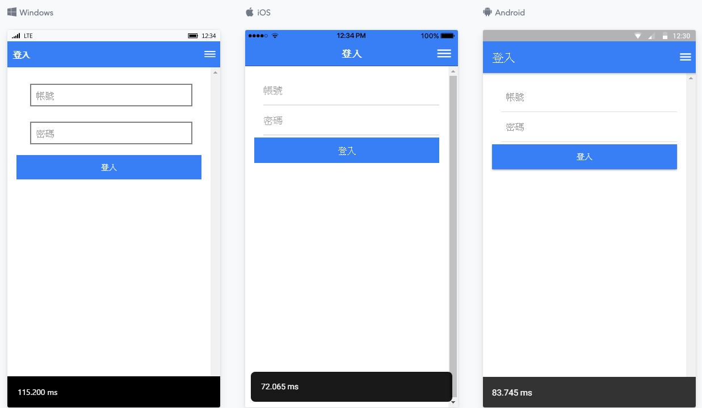
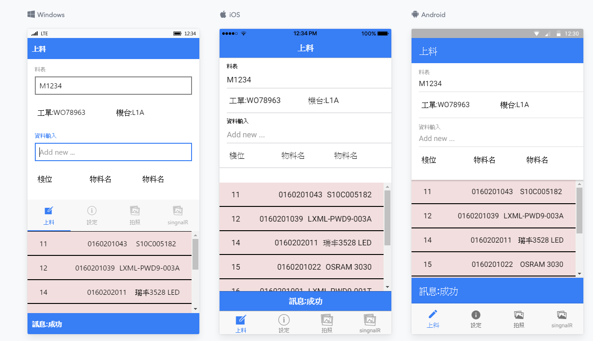
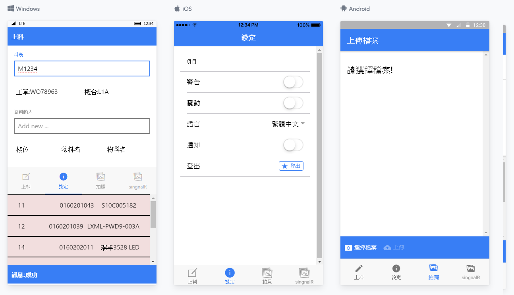

Hybrid APP Sample
===================================

This sample demonstrates how to use SMT/coded by ioinic2,typescript,cordova and some other function tips. 
See below lists.

Introduction
------------

function: 
1.login 
2.slot check 
3.problems that can take photos for upload  
etc.....

 

Pre-requisites
--------------

- ioinic2
- typescript
- cordova

Screenshots
-------------

 
 
 

Getting Started
---------------

This sample uses the angular2 -cli build system. To build this project, use the

    "clean": "ionic-app-scripts clean"
    "build": "ionic-app-scripts build"
    "ionic:build": "ionic-app-scripts build"
    "ionic:serve": "ionic-app-scripts serve"
    "e2e": "ionic-app-scripts build && protractor"
    "start": "ionic serve"
    "test-coverage": "ng test --code-coverage"
    "test": "ng test"
    "test-ci": "ng test --watch=false --code-coverage"

Support
-------

License
-------

Copyright 2017 The Android Open Source Project, Inc.

Licensed to the Apache Software Foundation (ASF) under one or more contributor
license agreements.  See the NOTICE file distributed with this work for
additional information regarding copyright ownership.  The ASF licenses this
file to you under the Apache License, Version 2.0 (the "License"); you may not
use this file except in compliance with the License.  You may obtain a copy of
the License at

http://www.apache.org/licenses/LICENSE-2.0

Unless required by applicable law or agreed to in writing, software
distributed under the License is distributed on an "AS IS" BASIS, WITHOUT
WARRANTIES OR CONDITIONS OF ANY KIND, either express or implied.  See the
License for the specific language governing permissions and limitations under
the License.
